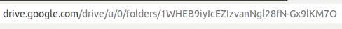

# Trabalho 3 da disciplina de Inteligência Artificial

Disciplina ministrada no primeiro semestre de 2020

Código da disciplina: SCC0530

Professor: Alneu de Andrade Lopes

Monitores PAE: Fabiana Góes, Renan Guilherme Nespolo

## Descrição do Trabalho

O trabalho prático consiste na implementação de cinco algoritmos de busca, dois de busca cega e três de busca informada, vistos na disciplina.

A descrição inteira está no arquivo PDF.

## Alunos

Humberto Guenzo Yoshimoto Tello

Mateus Morishigue Borges

Vinícius Gonçalves de Carvalho

## Instalação

Esse trabalho foi desenvolvido em [Google Apps Script](https://developers.google.com/apps-script/reference/). Para rodá-lo, clone e crie um novo projeto via [clasp](https://github.com/google/clasp/) ou crie um novo projeto diretamente [aqui](https://script.google.com/home/), depois adicione todas os arquivos de código.
Também é possível fazer uma cópia [dessa planilha](https://docs.google.com/spreadsheets/d/1yjOf1Iz7ZzIPLpFNHa4MslypJZYrVNXf0gSK9QA90Go/edit?usp=sharing).

Para rodar na sua planilha, é preciso trocar duas variáveis no arquivo de configurações `config.js`:

* Variável SHEET: o parâmetro do método getSheetByName() deve ser igual ao nome da página na planilha.

* Variável FOLDER_ID: crie uma pasta no Google Drive e pegue o ID (o que tiver depois de `/folders/`). Troque a variável por esse novo ID.

### Arquivos

* O arquivo `ui.js` contém todas as funções que utilizam a classe [Ui](https://developers.google.com/apps-script/reference/base/ui) do Apps Script.

* O arquivo `config.js` contém todas as configurações globais, como as classes, cores, tamanho das células, etc.

* O arquivo `map.js` contém todas as funções que manipulam a planilha.

* O arquivo `drive.js` contém todas as funções que manipulam o Google Drive (salvar e carregar mapas).

* O arquivo `auxFunctions.js` contém todas as funções auxiliares para a execução das buscas.

* Os arquivos `aStarSearch.js`, `bestFirstSearch.js`, `breadthFirstSearch.js`, `depthFirstSearch.js` e `hillClimbingSearch.js` contêm os algoritmos de busca.

